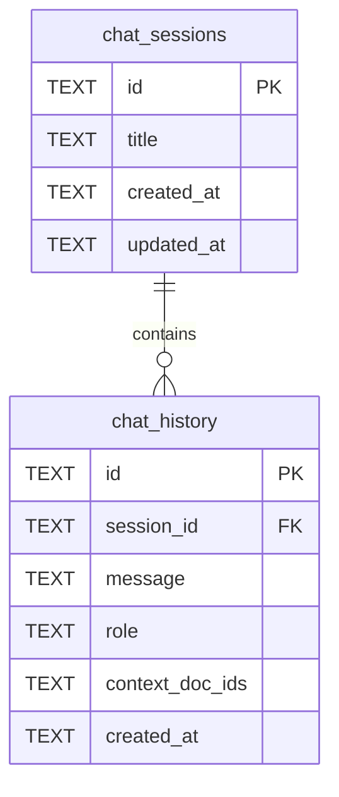
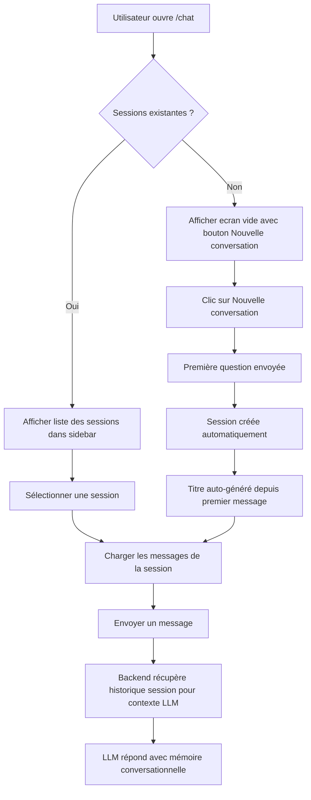

# Plan: Chat par Session

## Résumé

Transformer le chat unique actuel en un système multi-sessions, où chaque conversation est isolée dans sa propre session. L'utilisateur peut créer de nouvelles conversations, naviguer entre elles, les renommer et les supprimer.

---

## Architecture actuelle

### Problèmes identifiés

1. **Pas de notion de session** — tous les messages vont dans une seule table `chat_history` sans regroupement
2. **Pas d'historique conversationnel** — chaque message est traité indépendamment par le LLM (pas de mémoire multi-tour)
3. **Interface mono-conversation** — le frontend affiche un unique flux de messages sans possibilité de séparer les sujets

### Tables actuelles

```
chat_history: id, message, role, context_doc_ids, created_at
```

---

## Architecture cible



### Flux utilisateur



---

## Changements détaillés

### 1. Backend — database.py

#### Nouvelle table `chat_sessions`

```python
CREATE TABLE IF NOT EXISTS chat_sessions (
    id         TEXT PRIMARY KEY,
    title      TEXT NOT NULL,
    created_at TEXT NOT NULL,
    updated_at TEXT NOT NULL
);
```

#### Migration `chat_history` — ajout colonne `session_id`

```python
ALTER TABLE chat_history ADD COLUMN session_id TEXT REFERENCES chat_sessions(id) ON DELETE CASCADE;
```

#### Nouvelles fonctions CRUD

- `create_chat_session(session_id, title)` — crée une session
- `list_chat_sessions(limit, offset)` — liste paginée, triée par `updated_at DESC`
- `count_chat_sessions()` — total pour pagination
- `get_chat_session(session_id)` — récupère une session
- `update_chat_session_title(session_id, title)` — renomme
- `delete_chat_session(session_id)` — suppression (CASCADE supprime les messages)
- Modifier `insert_chat_message()` — ajouter paramètre `session_id`
- Modifier `get_chat_history()` — filtrer par `session_id` obligatoire
- Ajouter `get_session_messages_for_llm(session_id, limit)` — retourne les N derniers messages de la session, ordre chronologique, pour construire le contexte multi-tour

### 2. Backend — models.py

#### Nouveaux modèles

```python
class ChatSessionResponse(BaseModel):
    id: str
    title: str
    created_at: str
    updated_at: str

class ChatSessionListResponse(BaseModel):
    sessions: list[ChatSessionResponse]
    total: int

class ChatSessionCreateRequest(BaseModel):
    title: Optional[str] = None  # auto-generated if absent

class ChatSessionUpdateRequest(BaseModel):
    title: str
```

#### Modifications

- `ChatRequest` — ajouter `session_id: Optional[str] = None` (si absent, crée une nouvelle session)
- `ChatResponse` — ajouter `session_id: str` (retourne l'ID de la session)
- `ChatHistoryResponse` — ajouter champ session info optionnel

### 3. Backend — main.py

#### Nouveaux endpoints

| Méthode | Route | Description |
|---------|-------|-------------|
| GET | `/api/chat/sessions` | Liste les sessions (paginé) |
| POST | `/api/chat/sessions` | Crée une session vide |
| GET | `/api/chat/sessions/{id}` | Détail d'une session |
| PUT | `/api/chat/sessions/{id}` | Renommer une session |
| DELETE | `/api/chat/sessions/{id}` | Supprimer session + messages |

#### Modifications endpoint `/api/chat`

1. Si `session_id` est fourni, utiliser cette session
2. Si `session_id` est absent, créer une nouvelle session avec titre auto-généré (premiers 50 chars du message)
3. Récupérer les N derniers messages de la session (ex: 10 derniers échanges)
4. Construire un tableau `messages` multi-tour pour l'appel LLM
5. Mettre à jour `updated_at` de la session après chaque message
6. Retourner `session_id` dans la réponse

#### Modification endpoint `/api/chat/history`

- Ajouter paramètre query `session_id` obligatoire
- Filtrer uniquement les messages de cette session

### 4. Backend — llm.py

#### Nouvelle fonction `chat_with_context_multiturn()`

Remplacer ou adapter `chat_with_context()` pour accepter un historique conversationnel :

```python
def chat_with_context_multiturn(
    client: httpx.Client,
    user_message: str,
    context_documents: list[dict],
    conversation_history: list[dict],  # [{role, content}, ...]
) -> str:
```

L'appel LLM passera de :
```
messages: [system, user]
```
à :
```
messages: [system, ...history, user]
```

Cela permet au LLM d'avoir la mémoire des échanges précédents dans la session.

### 5. Backend — prompts.py

Adapter `RAG_CHAT_PROMPT` pour le multi-tour — indiquer au LLM qu'il a accès à l'historique de la conversation et qu'il doit maintenir la cohérence.

### 6. Frontend — api.ts

#### Nouveaux types

```typescript
interface ChatSession {
    id: string;
    title: string;
    created_at: string;
    updated_at: string;
}
```

#### Nouvelles fonctions API

- `getChatSessions(limit?, offset?)` → `{ sessions, total }`
- `createChatSession(title?)` → `ChatSession`
- `updateChatSession(id, title)` → `ChatSession`
- `deleteChatSession(id)` → `void`
- Modifier `sendChatMessage(message, sessionId?)` — ajouter `session_id`
- Modifier `getChatHistory(sessionId, limit?, offset?)` — `session_id` obligatoire
- Modifier retour `sendChatMessage` pour inclure `session_id`

### 7. Frontend — chat/page.tsx

Refonte complète de la page chat avec un layout en deux panneaux :

```
┌──────────────────────────────────────────────┐
│ Chat Header                                   │
├──────────────┬───────────────────────────────┤
│ Sessions     │ Messages                       │
│ sidebar      │                                │
│              │                                │
│ [+ Nouveau]  │  [user msg]                   │
│              │       [assistant msg]          │
│ Session 1 ●  │  [user msg]                   │
│ Session 2    │       [assistant msg]          │
│ Session 3    │                                │
│              │                                │
│              ├───────────────────────────────┤
│              │ [Input area]          [Send]   │
└──────────────┴───────────────────────────────┘
```

#### Comportements clés

- **Chargement initial** : charger la liste des sessions, sélectionner la plus récente
- **Nouvelle conversation** : bouton "+" crée une session au premier message envoyé
- **Sélection session** : clic sur une session charge ses messages
- **Titre auto** : le titre est généré depuis le premier message (tronqué à ~50 chars)
- **Renommage** : double-clic sur le titre pour le modifier
- **Suppression** : bouton poubelle avec confirmation
- **Session active** : mise en surbrillance dans la sidebar
- **Responsive** : sidebar cachable sur mobile (drawer)

---

## Ordre d'implémentation

1. `database.py` — nouvelle table + migration + fonctions CRUD
2. `models.py` — nouveaux modèles Pydantic
3. `prompts.py` — prompt multi-tour
4. `llm.py` — support conversation multi-tour
5. `main.py` — nouveaux endpoints + modifications
6. `api.ts` — fonctions API frontend
7. `chat/page.tsx` — refonte interface

---

## Points d'attention

- **Migration DB** : utiliser `ALTER TABLE` avec try/except pour la rétrocompatibilité
- **Messages orphelins** : les anciens messages sans `session_id` seront ignorés (ou on peut créer une session "legacy" pour les regrouper)
- **Limite historique LLM** : limiter à ~10 derniers messages pour éviter de dépasser la fenêtre de contexte du LLM
- **Pas de breaking change API** : `session_id` optionnel sur `/api/chat` (crée automatiquement une session si absent)
