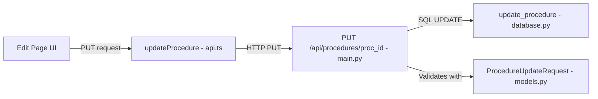

# Plan: Add Edit Procedures Feature

## Overview

The procedures feature currently supports **create**, **read**, **delete**, and **execute** — but not **edit/update**. This plan adds a full editing capability across all layers of the stack.

The edit page will be a **direct form** (not the wizard chat-style interface used for creation), since editing is about modifying existing fields rather than re-running the AI analysis.

## Architecture



## Editable Fields

| Field | Type | Notes |
|-------|------|-------|
| `name` | string | Procedure display name |
| `procedure_type` | string | One of: administrative, contrat, bancaire, sante, emploi, immobilier |
| `description` | string | AI-generated or user-edited summary |
| `remarks` | string | User notes |
| `required_documents` | array | List of `{doc_type, label, description}` objects — add/edit/remove items |

## Implementation Steps

### 1. Database: `update_procedure()` in `database.py`

Add a new function after the existing `delete_procedure()`:

```python
def update_procedure(
    proc_id: str,
    name: str | None = None,
    procedure_type: str | None = None,
    description: str | None = None,
    required_documents: list[dict] | None = None,
    remarks: str | None = None,
) -> None:
```

- Builds a dynamic `UPDATE procedures SET ... WHERE id = ?` query using only non-None fields
- Serializes `required_documents` to JSON if provided
- Always updates `updated_at` to current timestamp

### 2. Model: `ProcedureUpdateRequest` in `models.py`

Add after `ProcedureCreateRequest`:

```python
class ProcedureUpdateRequest(BaseModel):
    name: Optional[str] = None
    procedure_type: Optional[str] = None
    description: Optional[str] = None
    required_documents: Optional[list[ProcedureRequiredDocument]] = None
    remarks: Optional[str] = None
```

All fields optional — only non-null fields are applied (partial update pattern, same as `DocumentUpdateRequest`).

### 3. Backend: `PUT /api/procedures/{proc_id}` in `main.py`

Add between `get_proc` and `delete_proc` endpoints:

- Validates procedure exists via `get_procedure(proc_id)`
- Extracts non-None fields from `ProcedureUpdateRequest`
- Converts `required_documents` list of Pydantic models to list of dicts for DB storage
- Calls `update_procedure(proc_id, **fields)`
- Returns updated `ProcedureResponse`

Import `ProcedureUpdateRequest` in the existing import block and `update_procedure` from database.

### 4. Frontend API: `updateProcedure()` in `frontend/src/lib/api.ts`

Add after `getProcedure()`:

```typescript
export async function updateProcedure(
  id: string,
  data: {
    name?: string;
    procedure_type?: string;
    description?: string;
    required_documents?: ProcedureRequiredDocument[];
    remarks?: string;
  }
): Promise<Procedure> {
  return fetchAPI(`/procedures/${id}`, {
    method: 'PUT',
    body: JSON.stringify(data),
  });
}
```

### 5. Frontend: Edit Page at `frontend/src/app/procedures/edit/page.tsx`

A form-based page loaded via `/procedures/edit?id=<proc_id>`:

**Layout:**
- Back button → returns to `/procedures/view?id=...`
- Page title: "Modifier la procédure"
- Form sections:
  1. **Name** — text input, pre-filled
  2. **Type** — select dropdown using `PROCEDURE_TYPES`, pre-filled
  3. **Description** — textarea, pre-filled
  4. **Remarks** — textarea, pre-filled
  5. **Required Documents** — editable list:
     - Each item shows: `doc_type` select + `label` text input + `description` text input + delete button
     - "Add document" button at the bottom to append a new empty row
- **Action buttons:** "Enregistrer" (submit) and "Annuler" (navigate back)
- On save success → redirect to `/procedures/view?id=...`

**Data flow:**
1. On mount: call `getProcedure(id)` to load current data
2. Populate form state from response
3. On submit: call `updateProcedure(id, formData)`
4. Handle loading/error states

### 6. Frontend: Edit Button in View Page (`frontend/src/app/procedures/view/page.tsx`)

Add an edit button (pencil icon) next to the existing delete button in the header:

```tsx
<Link
  href={`/procedures/edit?id=${procId}`}
  className="p-2 rounded-lg text-[#6b7280] hover:text-accent hover:bg-accent/10 transition-colors"
  title="Modifier"
>
  {/* Pencil SVG icon */}
</Link>
```

## Files Modified

| File | Change |
|------|--------|
| `database.py` | Add `update_procedure()` function |
| `models.py` | Add `ProcedureUpdateRequest` class |
| `main.py` | Add `PUT /api/procedures/{proc_id}` endpoint + imports |
| `frontend/src/lib/api.ts` | Add `updateProcedure()` function |
| `frontend/src/app/procedures/edit/page.tsx` | **New file** — edit form page |
| `frontend/src/app/procedures/view/page.tsx` | Add edit button link in header |
