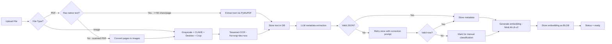
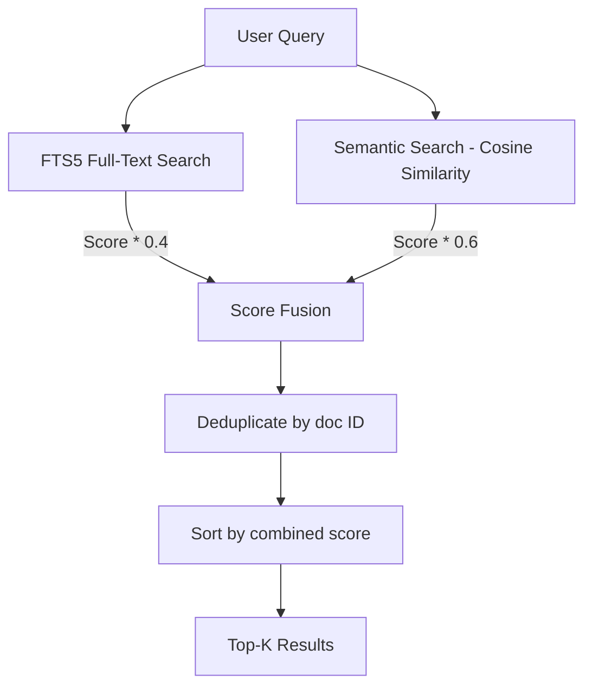
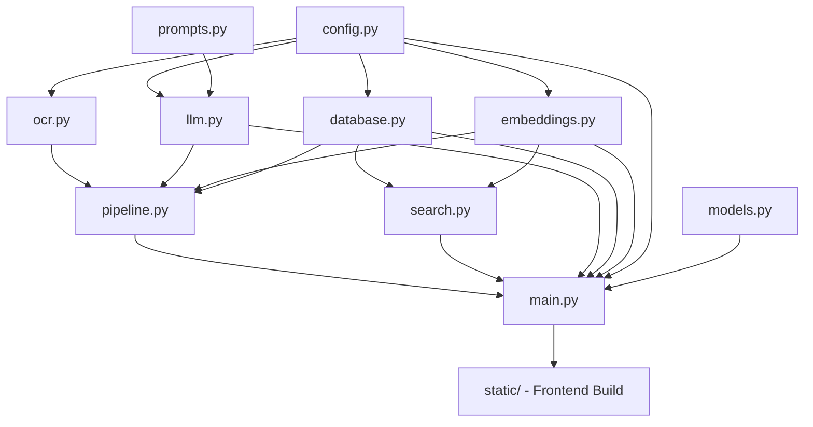

# DocuMind — Implementation Plan (MVP)

## Overview

DocuMind is a 100% local (zero-cloud) document management application that centralizes, digitizes, organizes, and retrieves personal documents via OCR + embedded AI. It runs as a single Docker container exposing `localhost:8000`.

---

## Architecture Diagram

```mermaid
graph TB
    subgraph Docker Container
        direction TB
        FE[Static Frontend - React]
        API[FastAPI - :8000]
        LLM[llama-cpp-python - LFM2.5 1.2B]
        OCR[pytesseract - Tesseract 5]
        EMB[sentence-transformers - MiniLM-L6-v2]
        DB[(SQLite + FTS5)]
        
        FE --> API
        API --> LLM
        API --> OCR
        API --> EMB
        API --> DB
    end
    
    subgraph Host Volume /data
        ORIG[/data/originals/]
        MODELS[/data/models/]
        DBFILE[/data/documind.db]
    end
    
    API --> ORIG
    LLM --> MODELS
    DB --> DBFILE
    
    USER[Browser - localhost:8000] --> FE
```

## Document Processing Pipeline



## Hybrid Search Flow



---

## Phase 1 — Project Scaffolding

Create the full directory structure and configuration files.

### Files to create:
- `config.py` — Centralized configuration: paths, constants, supported formats, max upload size, model parameters
- `requirements.txt` — All Python dependencies pinned to compatible versions
- `Dockerfile` — Single-stage build with Python 3.12-slim, Tesseract, language packs
- `docker-compose.yml` — Convenience wrapper with volume mount
- `setup.sh` — Script to download the GGUF model from HuggingFace
- `.dockerignore` — Exclude frontend node_modules, .git, etc.
- `.gitignore` — Standard Python + Node ignores

### Key decisions:
- All paths configurable via `config.py` with `/data/` as the default base
- `DATA_DIR`, `ORIGINALS_DIR`, `MODELS_DIR`, `DB_PATH` as constants
- Supported formats: `PDF, JPG, JPEG, PNG, TIFF, WEBP`
- Max upload: 50 MB
- LLM config: `n_ctx=8192`, `n_threads=4`, `temperature=0.1`, `max_tokens=512`

---

## Phase 2 — Database Layer

### Files to create:
- `database.py` — SQLite connection management, schema creation, FTS5 index, CRUD operations

### Schema:

**Table `documents`:**
| Column | Type | Constraints |
|--------|------|-------------|
| id | TEXT | PK, UUID |
| filename | TEXT | NOT NULL |
| filepath | TEXT | NOT NULL |
| text_content | TEXT | |
| doc_type | TEXT | |
| emetteur | TEXT | |
| doc_date | TEXT | YYYY-MM-DD |
| montant | REAL | nullable |
| reference | TEXT | nullable |
| destinataire | TEXT | nullable |
| resume | TEXT | |
| tags | TEXT | JSON array serialized |
| embedding | BLOB | numpy vector |
| status | TEXT | processing/ready/error |
| created_at | TEXT | ISO 8601 |
| updated_at | TEXT | ISO 8601 |

**FTS5 virtual table `documents_fts`:**
- Indexed on `text_content`
- Content table linked to `documents`

**Table `chat_history`:**
| Column | Type | Constraints |
|--------|------|-------------|
| id | TEXT | PK, UUID |
| message | TEXT | NOT NULL |
| role | TEXT | user/assistant |
| context_doc_ids | TEXT | JSON array |
| created_at | TEXT | ISO 8601 |

### Functions to implement:
- `init_db()` — Create tables, FTS5 index, ensure schema
- `insert_document()` — Insert new document record
- `update_document()` — Update metadata fields
- `update_document_status()` — Update status field
- `get_document()` — Get by ID
- `list_documents()` — List with filters: type, emetteur, date range, search query
- `delete_document()` — Delete record + file
- `search_fts()` — FTS5 search returning ranked results with scores
- `insert_chat_message()` — Insert chat history entry
- `get_chat_history()` — Retrieve chat history with pagination
- `get_all_embeddings()` — Load all embeddings for semantic search
- `get_stats()` — Aggregate stats: count by type, by month, totals

---

## Phase 3 — OCR Pipeline

### Files to create:
- `ocr.py` — Image preprocessing + Tesseract OCR extraction

### Functions to implement:
- `preprocess_image(image_path)` — Full preprocessing pipeline:
  1. Load image with OpenCV
  2. Convert to grayscale
  3. Apply CLAHE contrast enhancement
  4. Deskew using minAreaRect rotation detection
  5. Edge detection and document crop
  6. Return processed image as numpy array
- `extract_text_from_image(image_or_path)` — Run Tesseract with `fra+eng+deu+ara` languages, return raw text
- `extract_text_from_pdf(pdf_path)` — Try native text extraction via PyMuPDF first. If text < 50 chars/page, convert each page to image and OCR
- `extract_text(file_path)` — Dispatcher based on file extension: routes to image or PDF handler

---

## Phase 4 — LLM Integration

### Files to create:
- `llm.py` — Wrapper around llama-cpp-python for metadata extraction and chat
- `prompts.py` — All system prompts as constants

### Functions to implement in `llm.py`:
- `load_model(model_path, n_ctx, n_threads)` — Load GGUF model, return Llama instance
- `extract_metadata(llm, ocr_text)` — Send OCR text with metadata extraction prompt, parse JSON response, validate fields, retry once on failure
- `chat_with_context(llm, user_message, context_documents)` — Send user question with RAG context, return assistant response
- `_parse_and_validate_metadata(response_text)` — Parse JSON, validate required fields, normalize values

### Prompts in `prompts.py`:
- `METADATA_EXTRACTION_PROMPT` — System prompt for extracting structured metadata from OCR text
- `METADATA_CORRECTION_PROMPT` — Retry prompt when first extraction fails
- `RAG_CHAT_PROMPT` — System prompt for conversational RAG with document citations
- `VALID_DOC_TYPES` — List of allowed document types for validation

---

## Phase 5 — Embeddings

### Files to create:
- `embeddings.py` — Sentence-transformers wrapper for encoding and similarity

### Functions to implement:
- `load_embedding_model(model_name, cache_dir)` — Load all-MiniLM-L6-v2, cache in `/data/models/`
- `generate_embedding(model, text)` — Encode text, return numpy array
- `cosine_similarity(vec_a, vec_b)` — Compute cosine similarity between two vectors
- `semantic_search(query_embedding, doc_embeddings, top_k)` — Find top-K most similar documents by cosine distance
- `serialize_embedding(vector)` — Convert numpy array to bytes for BLOB storage
- `deserialize_embedding(blob)` — Convert BLOB bytes back to numpy array

---

## Phase 6 — Document Processing Pipeline

### Files to create:
- `pipeline.py` — Orchestrates the full document processing flow

### Functions to implement:
- `process_document(doc_id, file_path, llm, embedding_model, db)` — Full pipeline:
  1. Update status to "processing"
  2. Call OCR extraction based on file type
  3. Store OCR text in DB
  4. Call LLM metadata extraction
  5. Store metadata in DB
  6. Generate embedding
  7. Store embedding in DB
  8. Update status to "ready"
  9. Handle errors: set status to "error", log details
- `reprocess_document(doc_id, llm, embedding_model, db)` — Re-run LLM extraction + embedding on existing OCR text

### Error handling:
- Each step wrapped in try/except
- On failure: status set to "error", partial data preserved
- LLM retry logic: one retry with correction prompt on invalid JSON
- Logging at each step for debugging

---

## Phase 7 — FastAPI Application

### Files to create:
- `main.py` — FastAPI app with lifespan, route registration, static file serving
- `models.py` — Pydantic schemas for request/response validation

### Lifespan management:
1. Load LLM model into `app.state.llm`
2. Load embedding model into `app.state.embedding_model`
3. Initialize database schema
4. Load all embeddings into memory for semantic search: `app.state.embeddings_cache`

### Pydantic models in `models.py`:
- `DocumentResponse` — Full document with all metadata
- `DocumentListResponse` — Paginated list of documents
- `DocumentUpdateRequest` — Partial update of metadata fields
- `SearchRequest` — Query string for hybrid search
- `SearchResponse` — Ranked results with scores
- `ChatRequest` — User message for RAG chat
- `ChatResponse` — Assistant reply with source document IDs
- `StatsResponse` — Dashboard statistics
- `UploadResponse` — Upload confirmation with document ID and status

### API Endpoints:
| Method | Path | Description |
|--------|------|-------------|
| POST | /api/documents/upload | Upload file, start async pipeline |
| GET | /api/documents | List with filters and pagination |
| GET | /api/documents/{id} | Document detail with metadata |
| PUT | /api/documents/{id} | Edit metadata manually |
| DELETE | /api/documents/{id} | Delete document and file |
| POST | /api/search | Hybrid search |
| POST | /api/chat | RAG chat |
| GET | /api/chat/history | Chat history |
| GET | /api/stats | Dashboard statistics |
| GET | /api/health | Health check |

### Async processing:
- Upload endpoint uses `BackgroundTasks` to run the pipeline asynchronously
- Returns immediately with document ID and status "processing"
- Client polls `GET /api/documents/{id}` to check status
- Optional: SSE endpoint `GET /api/documents/{id}/status` for real-time updates

### Static file serving:
- Mount `/static` directory for frontend assets
- Serve `index.html` as catch-all for client-side routing
- Model download instructions page when GGUF file is missing

---

## Phase 8 — Hybrid Search

### Files to create:
- `search.py` — Hybrid search combining FTS5 and semantic similarity

### Functions to implement:
- `hybrid_search(query, db, embedding_model, embeddings_cache, top_k=20)`:
  1. Run FTS5 search, get results with BM25 scores
  2. Generate query embedding
  3. Run semantic search against cached embeddings
  4. Normalize both score sets to 0-1 range
  5. Combine: `final_score = 0.4 * fts_score + 0.6 * semantic_score`
  6. Deduplicate by document ID, keeping highest score
  7. Sort by final score descending
  8. Return top-K results with scores and document metadata
- `refresh_embeddings_cache(db)` — Reload all embeddings from DB into memory

### Performance notes:
- All embeddings loaded into memory at startup via numpy array
- Cosine similarity computed with numpy vectorized operations
- Viable for up to ~5000 documents per the spec
- Cache refreshed after each new document is processed

---

## Phase 9 — Chat RAG

### Implementation in `main.py` chat endpoint:

### Flow:
1. Receive user message
2. Run semantic search to find 3-5 most relevant documents
3. Build RAG context: truncate each document text to ~500 tokens
4. Format context with document metadata headers
5. Send to LLM with RAG system prompt
6. Store user message and assistant response in `chat_history`
7. Return response with source document IDs

### Features:
- Chat history retrieval with pagination
- Source documents linked in response for frontend clickability
- Context window management: ensure total prompt fits in 8192 tokens

---

## Phase 10 — Frontend

### Technology: React with Next.js static export

### Directory: `frontend/`

### Pages:
1. **Dashboard** `/` — Total doc count, type distribution pie chart, recent documents, search bar
2. **Library** `/documents` — Grid/list view, filter sidebar with type/emetteur/date, sort options, search
3. **Document Detail** `/documents/[id]` — Split view: file preview left, editable metadata right, re-analyze button, delete button
4. **Chat** `/chat` — Conversational UI, cited documents as clickable links, chat history
5. **Upload** — Floating "+" button or drag-and-drop zone, multi-file support, progress indicators

### Design system:
- Primary background: `#F5F0EB`
- Secondary background: `#E8DDD3`
- Accent color: `#2E75B6`
- Rounded corners, clean typography
- Optional dark mode toggle

### Components:
- `DocumentCard` — Thumbnail, type badge, emetteur, date, amount
- `SearchBar` — Unified search with debounced queries
- `FilterSidebar` — Type checkboxes, emetteur dropdown, date range picker
- `MetadataEditor` — Inline-editable fields for document metadata
- `ChatMessage` — User/assistant message bubbles with source links
- `UploadZone` — Drag-and-drop area with file type validation
- `PieChart` — Simple type distribution visualization
- `FilePreview` — PDF viewer or image display
- `StatusBadge` — Processing/ready/error indicators

### Build:
- `next build && next export` produces static files → copied to `/app/static/`
- FastAPI serves these via `StaticFiles` mount

---

## Phase 11 — Docker & Deployment

### Dockerfile:
- Base: `python:3.12-slim`
- Install: Tesseract 5 + language packs fra/eng/deu/ara, OpenCV system deps
- Copy requirements, pip install
- Copy app code + pre-built static frontend
- Expose port 8000
- CMD: uvicorn

### docker-compose.yml:
```yaml
services:
  documind:
    build: .
    ports:
      - 8000:8000
    volumes:
      - ~/documind:/data
```

### setup.sh:
- Create `~/documind/models/` directory
- Download LFM2.5-1.2B GGUF Q4_K_M from HuggingFace via wget/curl
- Verify file integrity with checksum
- Print success message with instructions

### First-run experience:
- If GGUF model file missing, FastAPI serves a setup page with instructions
- Health endpoint reports model status

---

## Phase 12 — Testing, Error Handling & Documentation

### Testing:
- Unit tests for each module: OCR, LLM, embeddings, search, database
- Integration test for full pipeline: upload → OCR → LLM → embedding → search
- API endpoint tests with pytest + httpx
- Test fixtures with sample documents

### Error handling:
- Graceful degradation when LLM fails: document saved with OCR text, manual classification needed
- File validation: check format, size limit 50MB
- Database connection resilience
- Proper HTTP error codes and messages

### Documentation:
- `README.md` — Project overview, quick start, prerequisites
- API documentation auto-generated by FastAPI /docs endpoint
- Inline code documentation

---

## File Dependency Graph



## Implementation Order

The phases should be implemented in this exact order, as each builds on the previous:

1. **Scaffolding** → establishes all paths and configuration
2. **Database** → provides storage layer for everything else
3. **OCR** → first piece of the processing pipeline
4. **LLM** → second piece: metadata extraction
5. **Embeddings** → third piece: vector generation
6. **Pipeline** → orchestrates steps 3-5 together
7. **FastAPI** → exposes pipeline and data via REST API
8. **Search** → combines FTS5 and embeddings for retrieval
9. **Chat RAG** → uses search + LLM for conversational access
10. **Frontend** → user interface consuming the API
11. **Docker** → packaging and deployment
12. **Testing** → validation and hardening
