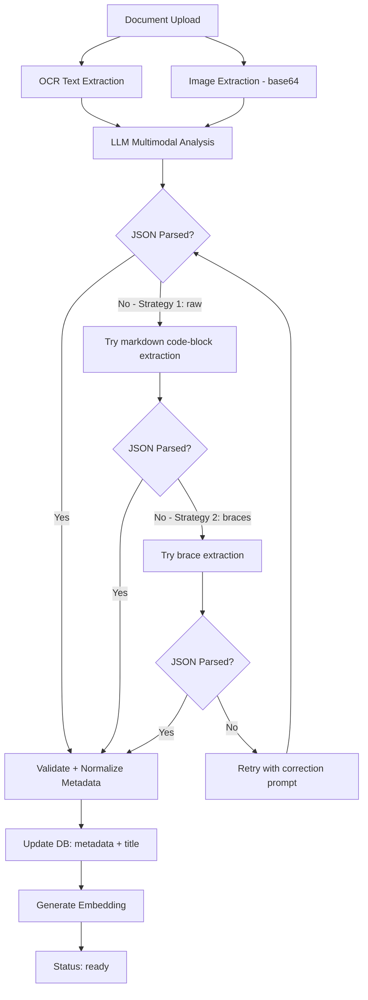
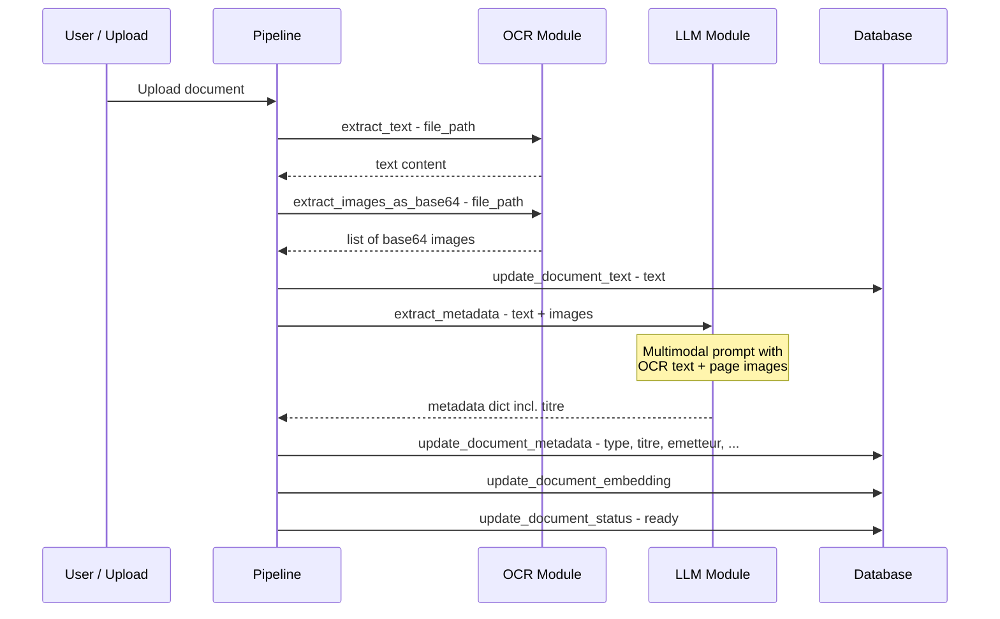

# Plan: Multimodal Document Analysis (OCR + AI Vision) & Title Field

## Problem Statement

The current DocuMind pipeline has three critical issues:

1. **LLM JSON parsing failures** — The LLM (Gemini via OpenRouter) consistently returns responses wrapped in markdown code blocks (` ```json ... ``` `), which `_parse_and_validate_metadata` cannot parse, causing both metadata extraction attempts to fail and falling back to default empty metadata (`type=autre`).

2. **Text-only analysis** — The pipeline only sends OCR-extracted text to the LLM. For scanned or image-heavy documents, key visual context (logos, layouts, signatures, stamps, formatted tables) is lost. The Gemini model supports multimodal input and should receive document images alongside text.

3. **No document title** — There is no `title` field in the data model. The frontend shows the raw `filename` everywhere, which is not meaningful. The LLM should generate a human-readable title during metadata extraction.

## Architecture Overview



## Detailed Changes

### 1. Fix JSON Parsing Bug — `llm.py`

**File:** `llm.py` line 120-154, function `_parse_and_validate_metadata`

**Problem:** The LLM wraps JSON in markdown code blocks. Current extraction strategies only try raw JSON parse and brace extraction.

**Solution:** Add a third strategy that strips markdown fencing before other strategies:

```python
# Strategy 0: strip markdown code fences (```json ... ``` or ``` ... ```)
import re
fence_match = re.search(r'```(?:json)?\s*\n?(.*?)```', text, re.DOTALL)
if fence_match:
    text = fence_match.group(1).strip()
```

This should be applied **before** the existing strategies, as it is the most likely format from Gemini models.

---

### 2. Add `title` Field — Full Stack

#### 2a. Database Schema — `database.py`

**Add column** `title TEXT` to the `documents` table in `init_db`, and add a migration `ALTER TABLE` for existing databases:

```sql
-- In init_db, after CREATE TABLE:
ALTER TABLE documents ADD COLUMN title TEXT;
```

**Update** `update_document_metadata` signature to include `title` parameter.

**Update** `update_document_fields` allowed set to include `"title"`.

#### 2b. Pydantic Models — `models.py`

- `DocumentResponse`: add `title: Optional[str] = None`
- `DocumentUpdateRequest`: add `title: Optional[str] = None`

#### 2c. LLM Prompt — `prompts.py`

Add `"titre"` to `METADATA_EXTRACTION_PROMPT`:

```
- "titre": un titre court et descriptif pour le document (ex: "Facture EDF Janvier 2024")
```

Also update `METADATA_CORRECTION_PROMPT` to include `"titre"`.

#### 2d. LLM Validation — `llm.py`

- Add `"titre"` to `required_fields` set in `_parse_and_validate_metadata`
- Add `"titre"` to fallback default metadata dict
- Map `titre` → `title` when returning from `extract_metadata`

#### 2e. Pipeline — `pipeline.py`

Pass `title=metadata.get("titre")` to `update_document_metadata` calls.

#### 2f. Frontend

- **`api.ts`**: add `title?: string` to `Document` interface
- **`DocumentCard.tsx`**: display `document.title || document.filename` as heading
- **`page.tsx` (detail view)**: show title prominently, fallback to filename
- **`MetadataEditor.tsx`**: add title as first editable field

---

### 3. Multimodal Vision Support

#### 3a. Image Extraction — `ocr.py`

Add new function `extract_images_as_base64`:

```python
def extract_images_as_base64(file_path: str, max_pages: int = 3, dpi: int = 200) -> list[str]:
    """Extract document pages as base64-encoded JPEG images for LLM vision.
    
    For PDFs: render each page as an image (up to max_pages).
    For images: return the single image as base64.
    Returns list of base64 strings (without data URI prefix).
    """
```

**Key design decisions:**
- Limit to first 3 pages to avoid token explosion
- Use 200 DPI (good quality but not excessive — ~1-2 MB per page)
- Convert to JPEG for smaller size
- Return raw base64 strings

#### 3b. Multimodal LLM Call — `llm.py`

Modify `_call_llm` to support an optional `images` parameter:

```python
def _call_llm(
    client: httpx.Client,
    system_prompt: str,
    user_message: str,
    images: list[str] | None = None,  # NEW: list of base64 JPEG strings
    temperature: float = LLM_TEMPERATURE,
    max_tokens: int = LLM_MAX_TOKENS,
) -> str:
```

When images are provided, the user message becomes a multimodal content array:

```python
if images:
    content_parts = [{"type": "text", "text": user_message}]
    for img_b64 in images:
        content_parts.append({
            "type": "image_url",
            "image_url": {"url": f"data:image/jpeg;base64,{img_b64}"}
        })
    user_content = content_parts
else:
    user_content = user_message
```

This is the standard OpenAI vision API format, which OpenRouter supports.

#### 3c. Update `extract_metadata` — `llm.py`

Add `images` parameter:

```python
def extract_metadata(
    client: httpx.Client,
    ocr_text: str,
    images: list[str] | None = None,
) -> dict:
```

Pass images through to `_call_llm` calls.

#### 3d. Update Pipeline — `pipeline.py`

In both `process_document` and `reprocess_document`:

1. Extract images from the document file using `extract_images_as_base64`
2. Pass both `text` and `images` to `extract_metadata`

```python
# After OCR step:
from ocr import extract_images_as_base64
images = extract_images_as_base64(file_path, max_pages=3)

# LLM step:
metadata = extract_metadata(llm, text, images=images)
```

For reprocessing, always extract images from the original file (even if text_content exists).

---

## Data Flow Summary



## File Change Summary

| File | Changes |
|------|---------|
| `llm.py` | Fix JSON parsing with code-fence strategy; add multimodal support to `_call_llm`; add images param to `extract_metadata`; add titre validation + fallback |
| `pipeline.py` | Extract images in both `process_document` and `reprocess_document`; pass images to LLM; pass title to DB |
| `ocr.py` | Add `extract_images_as_base64` function |
| `prompts.py` | Add `titre` field to both prompts |
| `database.py` | Add `title` column; update `update_document_metadata`; update allowed fields |
| `models.py` | Add `title` to `DocumentResponse` and `DocumentUpdateRequest` |
| `main.py` | No changes needed — generic field handling already works |
| `frontend/src/lib/api.ts` | Add `title` to Document interface |
| `frontend/src/components/DocumentCard.tsx` | Show title or fallback to filename |
| `frontend/src/components/MetadataEditor.tsx` | Add title as editable field |
| `frontend/src/app/documents/view/page.tsx` | Display title prominently |

## Risk Mitigation

- **Token costs**: Images increase prompt size significantly. Limiting to 3 pages at 200 DPI and JPEG compression keeps this manageable.
- **Backward compatibility**: The `title` column uses `ALTER TABLE ADD COLUMN` with no NOT NULL constraint, so existing documents with `title = NULL` work fine — the frontend falls back to `filename`.
- **LLM vision API compatibility**: OpenRouter's API supports the standard OpenAI vision message format for Gemini models. If the model doesn't support vision, the text-only path remains the fallback.
- **Error handling**: If image extraction fails, metadata extraction should still proceed with text-only (graceful degradation).
