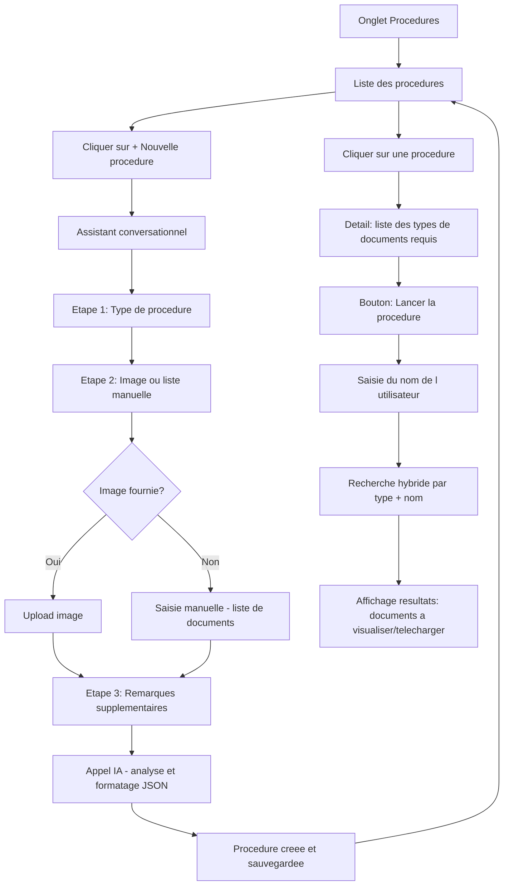

# Plan : Fonctionnalité "Procédures" pour DocuMind

## Vue d'ensemble

Ajouter un onglet **Procédures** permettant de créer des procédures administratives qui rassemblent les documents nécessaires. L'utilisateur peut ensuite **exécuter** une procédure en indiquant son nom pour retrouver automatiquement les documents correspondants dans sa base.

---

## Architecture

### Flux utilisateur



### Modèle de données

```mermaid
erDiagram
    procedures {
        TEXT id PK
        TEXT name
        TEXT procedure_type
        TEXT description
        TEXT required_documents JSON
        TEXT remarks
        TEXT status
        TEXT created_at
        TEXT updated_at
    }
    procedure_executions {
        TEXT id PK
        TEXT procedure_id FK
        TEXT person_name
        TEXT matched_documents JSON
        TEXT status
        TEXT created_at
    }
    procedures ||--o{ procedure_executions : has
```

---

## Détail des modifications

### 1. Backend — `models.py`

Ajouter les schémas Pydantic :

- **`ProcedureRequiredDocument`** : `{ doc_type: str, label: str, description: str | None }`
- **`ProcedureCreateRequest`** : `{ procedure_type: str, image_base64: str | None, manual_documents: list[str] | None, remarks: str | None }`
- **`ProcedureResponse`** : `{ id, name, procedure_type, description, required_documents: list[ProcedureRequiredDocument], remarks, status, created_at, updated_at }`
- **`ProcedureListResponse`** : `{ procedures: list[ProcedureResponse], total: int }`
- **`ProcedureExecuteRequest`** : `{ person_name: str }`
- **`ProcedureExecutionResponse`** : `{ id, procedure_id, person_name, matched_documents: list[MatchedDocument], status, created_at }`
- **`MatchedDocument`** : `{ required_doc_type: str, required_label: str, found: bool, document: DocumentResponse | None }`

### 2. Backend — `database.py`

Ajouter dans `init_db()` :
- Table **`procedures`** avec colonnes : `id, name, procedure_type, description, required_documents (JSON), remarks, status, created_at, updated_at`
- Table **`procedure_executions`** avec colonnes : `id, procedure_id, person_name, matched_documents (JSON), status, created_at`

Ajouter les fonctions CRUD :
- `insert_procedure(id, name, procedure_type, description, required_documents, remarks)`
- `get_procedure(id)` → dict
- `list_procedures(limit, offset)` → list[dict]
- `count_procedures()` → int
- `delete_procedure(id)`
- `insert_procedure_execution(id, procedure_id, person_name, matched_documents, status)`
- `get_procedure_execution(id)` → dict
- `search_documents_by_type_and_name(doc_type, person_name)` → recherche dans les documents existants en filtrant par `doc_type` et `destinataire` contenant `person_name`, triés par date décroissante

### 3. Backend — `prompts.py`

Ajouter :

- **`VALID_PROCEDURE_TYPES`** : liste des types de procédure acceptés
  ```python
  VALID_PROCEDURE_TYPES = [
      "administrative",  # mairie, préfecture...
      "contrat",         # bail, assurance...
      "bancaire",        # ouverture compte, prêt...
      "sante",           # carte vitale, médecin...
      "emploi",          # CV, onboarding...
      "immobilier",      # achat, location...
  ]
  ```

- **`PROCEDURE_ANALYSIS_PROMPT`** : prompt système demandant à l'IA d'analyser une description/image de procédure et de retourner un JSON structuré contenant :
  - `name` : nom court de la procédure
  - `description` : description résumée
  - `required_documents` : liste de `{ doc_type, label, description }` où `doc_type` correspond aux types existants dans `VALID_DOC_TYPES` (facture, fiche_de_paie, avis_imposition, contrat, attestation, courrier, releve_bancaire, quittance, identite, autre)

- **`PROCEDURE_MATCH_PROMPT`** : prompt système pour l'étape d'exécution, demandant à l'IA d'identifier le meilleur document parmi des candidats. L'IA reçoit :
  - Le type et label du document recherché
  - Le nom de la personne
  - La liste des documents candidats (titre, filename, text_content extrait, destinataire, emetteur, date, résumé)
  - L'IA doit analyser le contenu textuel, le nom du fichier, le destinataire et retourner l'ID du document le plus pertinent ou null

### 4. Backend — `llm.py`

Ajouter les fonctions :

- **`analyze_procedure(client, procedure_type, image_b64, manual_documents, remarks)`** :
  - Construit le message utilisateur avec le type de procédure, la liste manuelle et les remarques
  - Si `image_b64` est fourni, envoie en multimodal (comme l'extraction de métadonnées)
  - Appelle `_call_llm()` avec le `PROCEDURE_ANALYSIS_PROMPT`
  - Parse le JSON retourné et valide que chaque `doc_type` est dans `VALID_DOC_TYPES`
  - Retourne le dict structuré `{ name, description, required_documents }`

- **`match_document_for_procedure(client, required_doc, person_name, candidate_docs)`** :
  - Construit un prompt avec le document recherché (type + label), le nom de la personne, et la liste des candidats (id, titre, filename, text_content, destinataire, emetteur, date, résumé)
  - Appelle `_call_llm()` avec le `PROCEDURE_MATCH_PROMPT`
  - L'IA analyse le contenu textuel, le nom du document et les métadonnées pour trouver la meilleure correspondance
  - Retourne l'ID du document sélectionné ou None

### 5. Backend — `main.py`

Ajouter les endpoints API :

| Méthode | Route | Description |
|---------|-------|-------------|
| `POST` | `/api/procedures` | Créer une procédure (appel IA inclus) |
| `GET` | `/api/procedures` | Lister les procédures (paginé) |
| `GET` | `/api/procedures/{id}` | Détail d'une procédure |
| `DELETE` | `/api/procedures/{id}` | Supprimer une procédure |
| `POST` | `/api/procedures/{id}/execute` | Lancer la procédure : recherche de documents par nom |

**Endpoint `POST /api/procedures`** :
1. Reçoit `ProcedureCreateRequest`
2. Appelle `analyze_procedure()` pour obtenir le JSON structuré de l'IA
3. Insère en base avec `insert_procedure()`
4. Retourne `ProcedureResponse`

**Endpoint `POST /api/procedures/{id}/execute`** :
1. Reçoit `ProcedureExecuteRequest` avec `person_name`
2. Récupère la procédure et ses `required_documents`
3. **Boucle de recherche AI-assistée** pour chaque document requis :
   - a. Effectue une recherche hybride large : query = `"{label} {person_name}"` combinant FTS + sémantique
   - b. Filtre les résultats candidats par `doc_type` correspondant
   - c. Appelle `match_document_for_procedure()` qui envoie à l'IA :
     - Le type de document recherché + son label descriptif
     - Le nom de la personne
     - La liste des documents candidats avec : titre, filename, text_content, destinataire, emetteur, date, résumé
   - d. L'IA analyse le contenu textuel, le nom du fichier, les métadonnées et retourne l'ID du meilleur match ou null
   - e. Le document le plus récent est privilégié en cas d'ambiguïté
4. Sauvegarde l'exécution en base
5. Retourne `ProcedureExecutionResponse` avec la liste des documents trouvés/manquants

### 6. Frontend — `api.ts`

Ajouter les types TypeScript :
- `Procedure`, `ProcedureRequiredDocument`, `ProcedureExecution`, `MatchedDocument`

Ajouter les fonctions API :
- `createProcedure(data)` → POST `/api/procedures`
- `getProcedures(params?)` → GET `/api/procedures`
- `getProcedure(id)` → GET `/api/procedures/{id}`
- `deleteProcedure(id)` → DELETE `/api/procedures/{id}`
- `executeProcedure(id, personName)` → POST `/api/procedures/{id}/execute`

### 7. Frontend — `Sidebar.tsx`

Ajouter un 4ème item de navigation entre "Documents" et "Chat" :
- Label : **Procédures**
- Href : `/procedures`
- Icône : clipboard/checklist SVG

### 8. Frontend — Pages et Composants

#### `frontend/src/app/procedures/page.tsx` — Liste des procédures
- Grid/liste similaire à la page documents
- Chaque procédure affiche : nom, type, nombre de documents requis, date de création
- Bouton **"+ Nouvelle procédure"** en haut
- Clic sur une procédure → navigation vers `/procedures/[id]`

#### `frontend/src/app/procedures/new/page.tsx` — Assistant de création
Interface conversationnelle (style chat) avec les étapes :

1. **Étape 1 — Type de procédure** : boutons de choix (Administrative, Contrat, Bancaire, Santé, Emploi, Immobilier)
2. **Étape 2 — Documents requis** : 
   - Question : "Avez-vous une image listant les documents nécessaires ?"
   - Si oui → zone d'upload d'image (drag & drop)
   - Si non → interface de liste interactive pour ajouter manuellement chaque document (input + bouton ajouter, avec possibilité de supprimer)
3. **Étape 3 — Remarques** : textarea optionnel pour remarques supplémentaires
4. **Étape 4 — Analyse IA** : appel API, spinner de chargement, puis affichage du résultat (nom de la procédure, description, liste des documents requis avec leurs types)
5. **Confirmation** : bouton pour valider/modifier, puis sauvegarde

#### `frontend/src/app/procedures/[id]/page.tsx` — Détail d'une procédure
- En-tête : nom, type badge, description, remarques
- Section principale : **liste des documents requis** sous forme de cards/lignes avec :
  - Type de document (TypeBadge existant)
  - Label descriptif
  - Description optionnelle
- Bouton **"Lancer la procédure"** qui ouvre un dialogue/section :
  1. Input pour saisir le nom de la personne
  2. Bouton "Rechercher les documents"
  3. Affichage des résultats : pour chaque document requis → trouvé (avec lien visualiser/télécharger) ou manquant (indicateur rouge)

#### `frontend/src/components/ProcedureCard.tsx`
- Card affichant : nom, type badge, nombre de docs requis, date
- Similaire au composant DocumentCard existant

#### `frontend/src/components/ProcedureTypeBadge.tsx`
- Badge coloré pour les types de procédure (administrative, contrat, bancaire, santé, emploi, immobilier)

---

## Types de procédure ↔ Types de documents (mapping)

| Type de procédure | Documents typiquement requis |
|-------------------|------------------------------|
| Administrative | identite, attestation, courrier, avis_imposition |
| Contrat | identite, contrat, attestation, releve_bancaire |
| Bancaire | identite, fiche_de_paie, avis_imposition, releve_bancaire |
| Santé | identite, attestation, courrier |
| Emploi | identite, fiche_de_paie, contrat, attestation |
| Immobilier | identite, fiche_de_paie, avis_imposition, contrat, quittance, releve_bancaire |

> Note : ce mapping est indicatif. L'IA détermine les documents requis au cas par cas en se basant sur l'image/description fournie.

---

## Ordre d'implémentation recommandé

1. Backend : modèles + base de données (fondation)
2. Backend : prompt IA + fonction d'analyse
3. Backend : endpoints API
4. Frontend : types + fonctions API
5. Frontend : sidebar + routing
6. Frontend : page liste des procédures
7. Frontend : page création (assistant conversationnel)
8. Frontend : page détail + exécution
9. Tests et intégration complète
