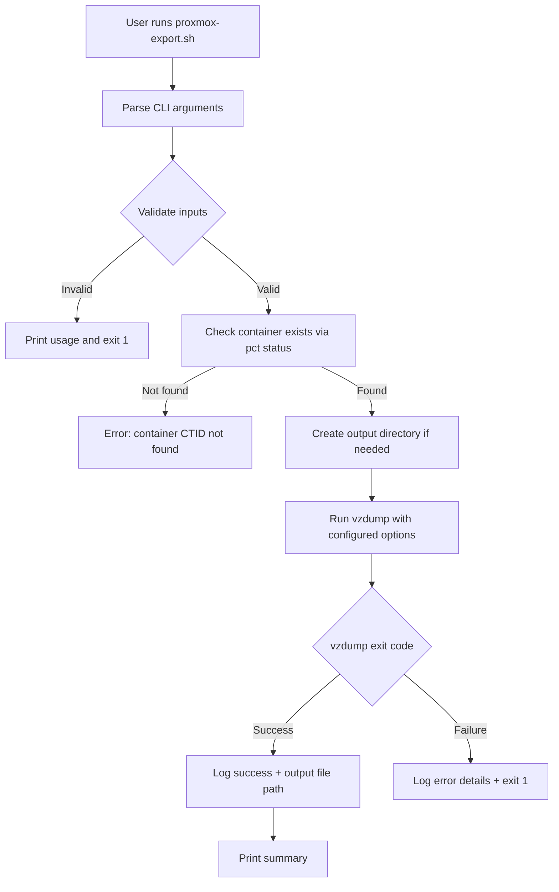

# Proxmox LXC Container Export Script — Plan

## Overview

A standalone bash script (`proxmox-export.sh`) that runs on a **Proxmox VE host** to backup/export an existing LXC container using `vzdump`. The script follows best practices inspired by the [community-scripts/ProxmoxVE](https://github.com/community-scripts/ProxmoxVE) repository while remaining simple and self-contained.

## Scope

| Feature | Included |
|---------|----------|
| Single container ID export | Yes |
| Configurable compression format | Yes (tar.zst default) |
| Snapshot backup mode | Yes (default, configurable) |
| Local directory export | Yes |
| Basic logging | Yes (stdout + log file) |
| Retention policy | No |
| Cron scheduling | No |
| Remote storage (PBS/NFS) | No |
| Email notifications | No |
| Multiple container IDs | No |

## How `vzdump` Works

`vzdump` is Proxmox's built-in backup utility. For LXC containers, key parameters are:

```bash
vzdump <CTID> \
  --mode snapshot \           # snapshot (live), suspend, or stop
  --compress zstd \           # zstd, gzip, lzo, or none
  --dumpdir /path/to/output \ # local directory for the backup file
  --notes-template "..." \    # optional notes attached to backup
  --quiet                     # reduce output verbosity
```

Output file naming convention by vzdump:
```
vzdump-lxc-<CTID>-<YYYY_MM_DD-HH_MM_SS>.tar.zst
```

## Script Architecture



## Script Parameters

| Flag | Long | Default | Description |
|------|------|---------|-------------|
| `-i` | `--id` | *required* | Container ID to export |
| `-d` | `--dumpdir` | `/var/lib/vz/dump` | Output directory for backup file |
| `-c` | `--compress` | `zstd` | Compression: `zstd`, `gzip`, `lzo`, `none` |
| `-m` | `--mode` | `snapshot` | Backup mode: `snapshot`, `suspend`, `stop` |
| `-l` | `--logfile` | `/var/log/proxmox-export.log` | Path to log file |
| `-h` | `--help` | — | Show usage help |

## File Structure

```
proxmox/
├── proxmox-export.sh       # Main export script
└── README.md               # Usage documentation
```

## Script Design Details

### 1. Header and Configuration

```bash
#!/usr/bin/env bash
set -Eeuo pipefail
```

- Strict mode for safety (`set -Eeuo pipefail`)
- Default variable definitions
- Color codes for terminal output

### 2. Utility Functions

- `msg_info()` — Blue info message with spinner-like prefix
- `msg_ok()` — Green success message
- `msg_error()` — Red error message
- `log()` — Write timestamped entry to log file + stdout
- `usage()` — Print help/usage text

### 3. Input Validation

- Ensure script runs as root (vzdump requires root)
- Validate CTID is a positive integer
- Validate compression option is one of: `zstd`, `gzip`, `lzo`, `none`
- Validate mode is one of: `snapshot`, `suspend`, `stop`
- Check that `vzdump` and `pct` commands exist
- Verify container exists via `pct status <CTID>`

### 4. Export Execution

- Create output directory if it does not exist
- Build `vzdump` command with all parameters
- Execute and capture exit code
- Log the full command executed for reproducibility

### 5. Post-Export

- On success: log the output file path, size, and duration
- On failure: log the error, vzdump stderr output
- Return appropriate exit code

## Example Usage

```bash
# Basic — export container 100 with defaults
./proxmox-export.sh --id 100

# Custom output directory and gzip compression
./proxmox-export.sh --id 100 --dumpdir /mnt/backups --compress gzip

# Stop mode (for consistent backup of busy containers)
./proxmox-export.sh --id 100 --mode stop

# Full example
./proxmox-export.sh \
  --id 100 \
  --dumpdir /mnt/nfs/proxmox-backups \
  --compress zstd \
  --mode snapshot \
  --logfile /var/log/ct100-export.log
```

## Validation Checklist

After implementation, verify:

- [ ] Script exits with error if not run as root
- [ ] Script exits with error if CTID is missing or invalid
- [ ] Script exits with error if container does not exist
- [ ] Script exits with error for invalid compression/mode values
- [ ] `vzdump` is called with correct parameters
- [ ] Output directory is created if missing
- [ ] Log file contains timestamped entries
- [ ] Success message shows file path and size
- [ ] Non-zero exit code on vzdump failure
- [ ] `--help` flag prints usage information
- [ ] Script passes `shellcheck` without warnings
